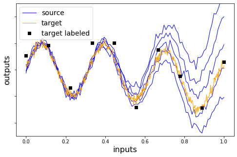
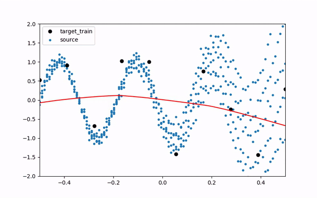
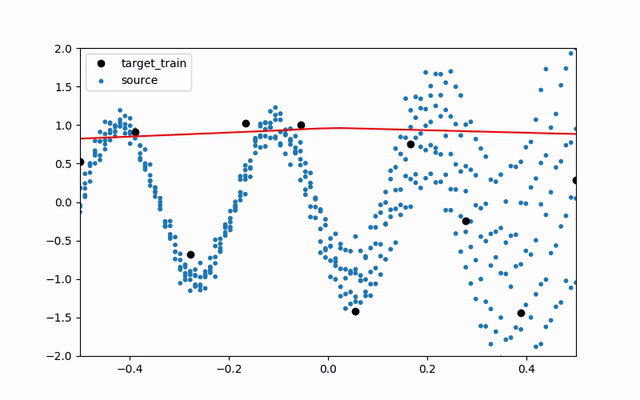
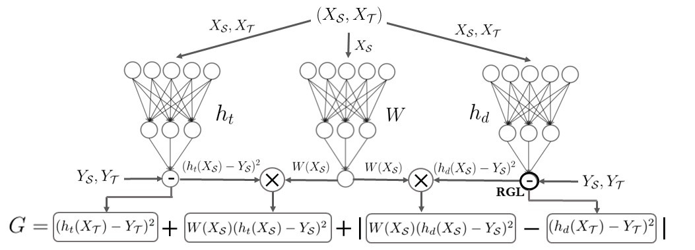
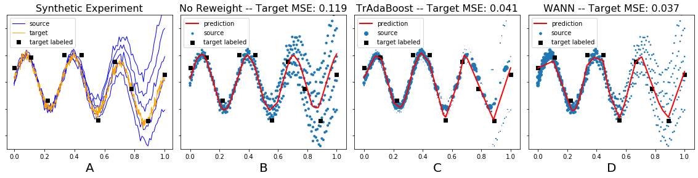

# WANN

Weighting Adversarial Neural Network

Synthetic Experiment Setup |  No Reweighting            
:-------------------------:|:-------------------------:
 |  
TrAdaBoostR2               |  WANN         
|   |   

WANN is a supervised domain adaptation method suited for regression tasks. The algorithm is an instance-based method which learns a reweighting of source instance losses in order to correct the difference between source and target distributions.

WANN algorithm consists to train three networks in parallel in the same gradient descent. The *weighting* network *W* learns the source instances weights which are multiplied to the source losses of the *task* and *discrepancy* networks *ht* and *hd*. The last network, which estimates the *Y*-discrepancy distance between the reweighted source and target instances, is trained with an opposite objective function (*-G*) than the two others. This is done by using a Reversal Gradient Layer (RGL) in bold on the Figure.

## Requirements

Code for the numerical experiments requires the following packages:
- `tensorflow` (>= 2.0)
- `scikit-learn`
- `numpy`
- `cvxopt`
- `nltk` (for sentiment analysis pre-processing)
- `matplotlib` (for visualization)

The file `environment.yml` can be used to reproduce the same conda environment as the one used to conduct the experiments with the following command line:
`conda env create -f environment.yml`

## Experiments

WANN algorithm is compared to several instances-based domain adaptation base-lines:
  - KMM [Huang et al.](http://papers.nips.cc/paper/3075-correcting-sample-selection-bias-by-unlabeled-data.pdf)
  - KLIEP [Sugiyama et al.](https://papers.nips.cc/paper/3248-direct-importance-estimation-with-model-selection-and-its-application-to-covariate-shift-adaptation.pdf)
  - TrAdaBoostR2 [Pardoe et al.](http://www.cs.utexas.edu/~pstone/Papers/bib2html/b2hd-ICML10-pardoe.html)
  - GDM [Cortes et al.](http://jmlr.org/papers/volume20/15-192/15-192.pdf)
  - DANN [Ganin et al.](https://arxiv.org/pdf/1505.07818.pdf)

The implementation of the methods can be found in the `wann\methods` folder. For GDM, code can be found at https://cims.nyu.edu/~munoz/ 

The experiments are conducted on one synthetic and three benchmark datasets: *Superconductivity*, *kin 8xy family* and *Amazon reviews*.

### Synthetic Experiment

The code of the synthetic experiment can be found in the following notebook `notebooks\Toy_experiments.ipynb`

### Superconductivity Experiments

Running superconductivity experiments can be done in two ways:
- In the command line with: `$ python wann\uci_experiments.py`
- Within the following notebooks: `notebooks\UCI_experiments.ipynb`

### Kin Experiments

Running kin experiments can be done in two ways:
- In the command line with: `$ python wann\kin_experiments.py`
- Within the following notebooks: `notebooks\Kin_experiments.ipynb`

### Sentiment Analysis Experiments

Running sentiment analysis experiments can be done in two ways:
- In the command line with: `$ python wann\sa_experiments.py`
- Within the following notebooks: `notebooks\sa_experiments.ipynb`

